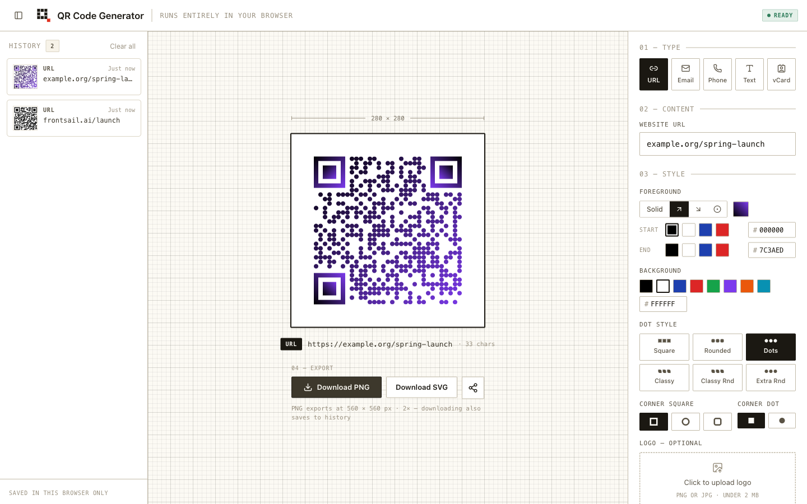

<p align="center">
  
</p>

<h1 align="center">QR Code Generator</h1>

<p align="center">
  <b>Design a QR code you'd actually print.</b><br>
  Live preview, gradients, dot styles, logo overlays, and shareable links —
  running entirely in your browser. No backend, no accounts, no tracking.
  Your designs never leave your machine.
</p>

<p align="center">
  <a href="https://qr-code-gen.frontsail.app/"><b>▶ Try it live</b></a>
  ·
  <a href="https://github.com/frontsail-ai/qr-code-generator/actions/workflows/ci.yml"></a>
</p>



## Features

- **Five content types:** URL, Email, Phone, Text, vCard
- **Live preview:** the code redraws as you type, with a capacity guard instead of silent failures
- **Styling:** solid or gradient foregrounds (linear/radial), background colors, 6 dot styles, corner styles, and logo overlays with a scannability warning
- **History:** every download is saved locally with a live thumbnail — restore, share, or delete any past design
- **Sharing:** designs encode into self-sufficient URLs; the recipient's browser rebuilds the design with nothing stored server-side
- **Export:** PNG at 2× resolution or SVG
- **Workspace UI:** three-pane desktop layout on an engineering-grid canvas; mobile gets a history drawer and a sticky export bar

## Tech stack

- React 19 + TypeScript
- [Vite+](https://viteplus.dev/) (dev server, build, lint, format, type checks)
- [Bun](https://bun.sh/) (package manager)
- Tailwind CSS v4
- Playwright (E2E testing)
- [qr-code-styling](https://github.com/kozakdenys/qr-code-styling)

## Getting started

### Prerequisites

- [Vite+](https://viteplus.dev/guide/) (`vp` CLI; manages Node.js and the package manager)
- [Bun](https://bun.sh/) 1.3+
- [just](https://github.com/casey/just) (optional, for convenience commands)

### Installation

```bash
vp install
```

### Development

```bash
vp dev
```

Open http://localhost:5173 in your browser.

### Production build

```bash
vp build
```

The built files will be in the `dist/` directory. Preview with `vp preview`.

## Development workflow

This project uses [just](https://github.com/casey/just) as a command runner. See available commands:

```bash
just --list
```

### Linting, formatting & type checks

```bash
just lint        # Format, lint, and type-check with auto-fix
just lint-ci     # Check-only mode (what CI runs)
```

### Testing

```bash
just test              # Full Playwright suite
bun run test:ui        # Playwright UI mode
bun run test:headed    # Visible browser
```

## CI

GitHub Actions runs on every push/PR to `master`/`main`: install, lint & type-check, test, build.

## About

Developed and maintained by [FrontSail AI](https://frontsail.ai/).

## License

MIT
